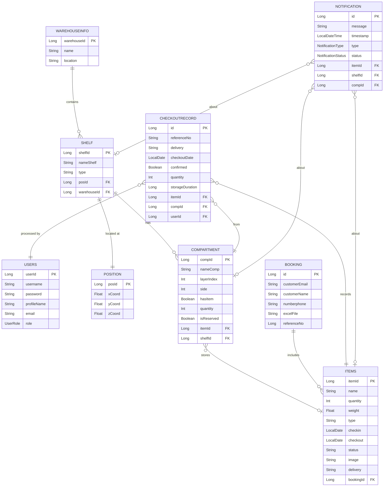

# 📐 Project Specification — WMS Backend

## 1. Tổng Quan Đề Tài

**Tên đề tài:** Hệ thống Quản lý Kho hàng (Warehouse Management System — WMS)
**Loại:** Đồ án Khóa luận Tốt nghiệp

**Bài toán:** Doanh nghiệp cần quản lý hàng hóa trong kho với khả năng:
- Nhận hàng vào kho theo đơn nhập (Booking), xếp vào ngăn kệ cụ thể
- Theo dõi vị trí hàng hóa trong kho theo mô hình 3D
- Thực hiện xuất hàng có kiểm soát (xác nhận/hủy), cập nhật tồn kho
- Nhận thông báo tự động khi hàng sắp đến hạn xuất kho
- In các báo cáo nghiệp vụ (phiếu nhập, phiếu giao hàng, phiếu xuất)

---

## 2. Sơ Đồ ERD



---

## 3. Luồng Nghiệp Vụ Chính

### 3.1 Nhập Kho

```
[Staff] Upload CSV file
    ↓
BookingController.upload()
    ↓
BookingServiceImpl.saveFormData()
    ├── Lưu file vào uploads/
    ├── Tạo Booking (email, referenceNo ngẫu nhiên)
    └── Parse từng row CSV → tạo Items với status = "Đang lưu kho"
```

**CSV format:**
| Name | Type | Quantity | Weight (g) | Checkin Date | Checkout Date | Image | Useremail | Delivery |
|------|------|----------|------------|--------------|---------------|-------|-----------|----------|
| Laptop Dell | Electronics | 10 | 2500 | 01/10/2024 | 31/10/2024 | url | user@mail.com | 51A-123.45 |

### 3.2 Phân Kệ (Gán Item vào Compartment)

```
[Staff] Chọn Item + Compartment + Quantity
    ↓
CompartmentController.addItem()
    ↓
CompartmentServiceImpl.addItemToCompartment() [@Transactional]
    ├── findByIdWithLock(compartmentId) — Pessimistic Lock
    ├── Kiểm tra: isReserved? type khớp?
    ├── Tính remaining = item.quantity - totalInCompartments - checkedOut
    └── Gán item → compartment, setHasItem=true
```

### 3.3 Xuất Kho

```
[Staff] Chọn Compartment + Item + referenceNo + delivery
    ↓
CompartmentController.checkoutItem()
    ↓
CompartmentServiceImpl.checkoutItem() [@Transactional REPEATABLE_READ]
    ├── Xác thực JWT → lấy User từ SecurityContext
    ├── findByIdWithLock(compartmentId) — Pessimistic Lock
    ├── Validate: !isReserved, date == today, referenceNo khớp, delivery khớp
    ├── setReserved = true (lock compartment)
    ├── Tạo CheckoutRecord (confirmed = false)
    └── Tạo Notification → push WebSocket /topic/notifications

[Manager] Xác nhận checkout
    ↓
CompartmentServiceImpl.confirmCheckout() [@Transactional]
    ├── setConfirmed = true
    ├── setReserved = false
    └── Nếu totalConfirmed >= item.quantity → item.status = "Đã xuất kho"
```

### 3.4 Scheduler Tự Động

| Job | Cron | Hành động |
|-----|------|-----------|
| `CheckoutReminderJob` | `0 */30 * * * ?` (30 phút) | Scan items có checkout = hôm nay → tạo CHECKOUT_REMINDER notification |
| `ItemCleanupService` | `0 0 0 * * ?` (0h hàng ngày) | Xóa CheckoutRecords + Items "Đã xuất kho" có checkout > 6 tháng trước |

---

## 4. Ma Trận Phân Quyền

| Chức năng | ROLE_ADMIN | ROLE_STAFF |
|-----------|------------|------------|
| Đăng nhập/Đăng ký | ✅ | ✅ |
| Xem danh sách hàng hóa | ✅ | ✅ |
| Upload CSV nhập kho | ✅ | ✅ |
| Phân kệ (gán Item → Compartment) | ✅ | ✅ |
| Khởi tạo checkout | ✅ | ✅ |
| Xác nhận/Hủy checkout | ✅ | ✅ |
| Xem thông báo | ✅ | ✅ |
| In báo cáo PDF | ✅ | ✅ |
| Quản lý Warehouse/Shelf | ✅ | ❌ _(dự kiến)_ |
| Xóa Booking | ✅ | ❌ _(dự kiến)_ |
| Xem tất cả users | ✅ | ❌ _(dự kiến)_ |

> 💡 Phân quyền ADMIN/STAFF đã được implement ở tầng data model. Việc enforce `@PreAuthorize` trên từng endpoint là bước tiếp theo trong roadmap.

---

## 5. ID Format

Các entity sử dụng ID có prefix để dễ nhận diện trên UI:

| Entity | Format | Ví dụ |
|--------|--------|-------|
| Booking | `BK` + 4 chữ số | `BK0001` |
| Item | `SP` + 4 chữ số | `SP0023` |
